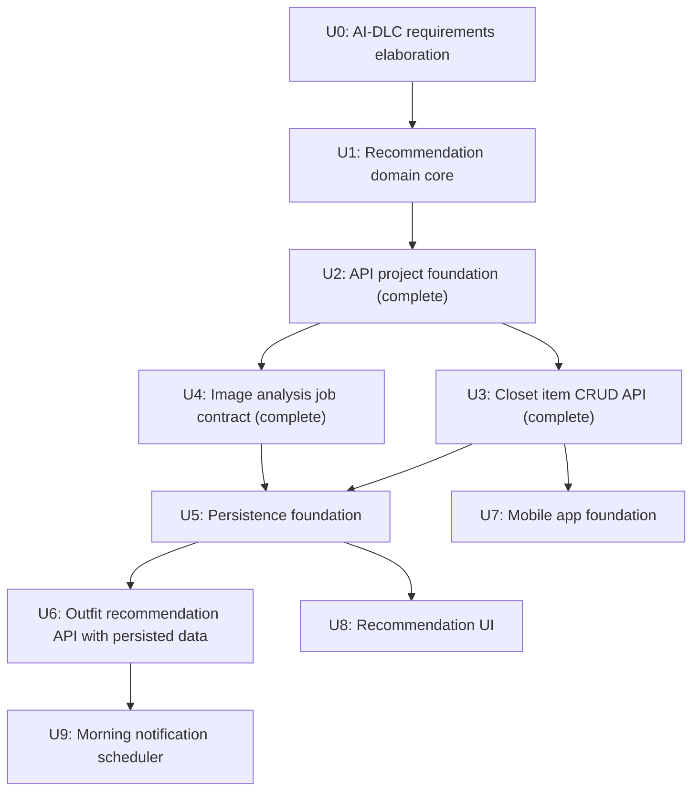

# 00. Intent State

## Intent

Build Fitlog, an AI wardrobe app that lets users digitize their own clothes from photos, turn each item into a consistent illustration, and receive outfit recommendations based on weather, style intent, trends, and wardrobe history.

## Source Context

- Primary requirements: `requirements/service_requirements.md`
- AI-DLC elaboration outputs: `requirements/ai_dlc/*.md`

## AI-DLC Interpretation

This project does not currently include an installed AI-DLC plugin or project-specific `.ai-dlc` settings. The workflow is therefore represented in repository files and mapped to the commonly used AI-DLC pattern:

- Inception / Elaborate: clarify intent, scope, domain, success criteria
- Construction / Execute: implement small verifiable units
- Delivery / Check: run tests, document residual risk, prepare next unit
- Operations: deployment, monitoring, feedback loops after app foundation exists

## Current State

- Inception / Elaborate: complete for the MVP baseline
- Construction / Execute: U4 Image analysis job contract complete; next unit is U5 Persistence foundation
- Delivery / Check: active through unit tests, API tests, and quality checklist
- Operations: not started

## Units of Work

## Machine-Checkable Success Criteria

- Recommendation core has deterministic unit tests.
- Recommendation core excludes unavailable closet items.
- Recommendation core respects fixed and excluded item constraints.
- Recommendation core reacts to cold, hot, and rainy weather.
- Recommendation core produces user-facing explanation strings.
- P0 backend and mobile work should be linked back to a backlog item in `06_delivery_backlog.md`.
- API job contracts expose machine-readable status and worker event payloads.

## Critical Human Decisions Still Open

- Final app stack: React Native Expo + FastAPI selected for MVP
- Authentication provider
- Image generation provider
- Weather API provider
- Brand name: Fitlog selected
- Visual direction
- MVP launch region
