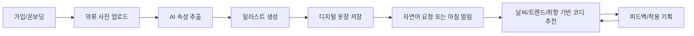

# 01. Discovery and Scope

## 1. 문제 정의

사용자는 옷을 많이 보유하고 있어도 매일 아침 어떤 조합이 어울리는지 판단하는 데 시간을 쓴다. 기존 옷장 앱은 수동 등록 부담이 크고, 추천 앱은 사용자가 실제로 가진 옷과 날씨, 취향, 최신 트렌드를 동시에 고려하지 못하는 경우가 많다.

이 서비스는 사용자의 실제 옷장을 사진으로 빠르게 디지털화하고, 보유 의류를 기반으로 실용적인 코디를 추천하는 것을 목표로 한다.

## 2. 핵심 가치 제안

- 사진 한 장으로 의류를 등록하고 데이터화한다.
- 실제 옷의 특징을 유지한 일러스트 옷장을 제공한다.
- 보유 의류, 날씨, 취향, 트렌드, 착용 이력을 함께 고려한다.
- 매일 아침 지정 시간에 바로 입을 수 있는 코디를 추천한다.
- 사용자가 원하는 느낌을 자연어로 입력하면 그 맥락에 맞는 스타일을 제안한다.

## 3. MVP 목표

MVP는 "내 옷을 등록하고, 오늘 입을 코디를 추천받는다"를 끝까지 검증하는 버전이다.

### 포함 범위

- 회원가입 및 기본 프로필
- 스타일 취향 온보딩
- 단일 의류 사진 업로드
- 의류 속성 자동 추출
- 의류 일러스트 생성
- 디지털 옷장 목록과 상세
- 자연어 스타일 요청
- 날씨 기반 추천
- 지정 시간 푸시 알림
- 추천 피드백 저장

### 제외 범위

- 한 장의 사진에서 여러 의류를 완전 자동으로 고정밀 분리
- 캘린더 자동 연동
- 커머스 상품 구매 추천
- 친구/커뮤니티 기능
- 자체 학습 모델 구축
- 고급 관리자 대시보드

## 4. 주요 사용자

### Primary Persona

- 이름: 출근 전 코디가 고민인 사용자
- 니즈: 매일 아침 날씨와 일정에 맞는 옷을 빨리 고르고 싶다.
- 문제: 옷장은 꽉 차 있지만 조합이 반복되고, 새로 산 옷도 잘 활용하지 못한다.
- 성공 경험: 알림을 열었을 때 "오늘 이대로 입으면 되겠다"는 확신을 얻는다.

### Secondary Persona

- 이름: 스타일을 실험하고 싶은 사용자
- 니즈: 최신 트렌드를 내 옷장 안에서 부담 없이 적용하고 싶다.
- 문제: 트렌드를 따라가고 싶지만 과하게 튀는 추천은 부담스럽다.
- 성공 경험: 평소 입던 옷을 새로운 조합으로 입게 된다.

## 5. 핵심 사용자 여정

## 6. 주요 가정

- 사용자는 처음에 모든 옷을 등록하지 않아도 일부 핵심 아이템만 등록하고 추천을 경험할 수 있어야 한다.
- MVP에서는 단일 의류 이미지 등록 정확도를 우선한다.
- 일러스트 생성은 실제 의류의 디테일 재현보다 "식별 가능하고 일관된 시각 표현"을 우선한다.
- 최신 트렌드는 실시간 소셜 분석보다 주기적으로 갱신되는 트렌드 시그널로 시작한다.
- 추천 품질은 초기에는 규칙 기반 필터와 LLM 기반 설명/랭킹 조합으로 검증한다.

## 7. 성공 기준

- 신규 사용자가 5분 안에 첫 의류를 등록할 수 있다.
- 첫 추천 결과에서 사용자가 최소 1개 코디를 저장하거나 긍정 피드백을 남긴다.
- 아침 알림을 받은 사용자가 추천 상세 화면으로 진입한다.
- 자동 추출된 의류 속성 중 핵심 카테고리와 색상 수정률이 30% 이하이다.
- 추천 결과에 대한 부정 피드백이 특정 사유에 편중되지 않는다.

## 8. 미정 사항

- 서비스명
- 브랜드 톤
- 일러스트 스타일
- 첫 출시 국가와 언어
- 날씨 API 제공자
- 이미지 생성 API 제공자
- 트렌드 데이터 소스
- 유료화 시점과 과금 기준

