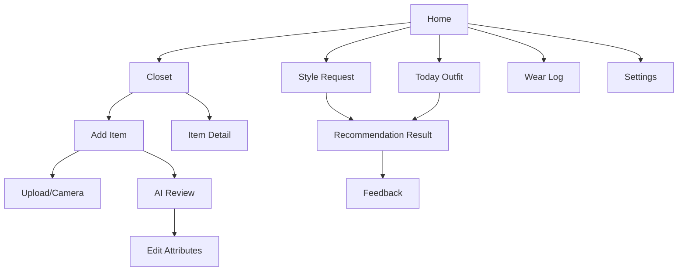

# 02. Product Flows

## 1. 화면 정보 구조

## 2. 온보딩 플로우

### 목표

추천 품질에 필요한 최소 취향 정보를 확보하되, 가입 부담을 줄인다.

### 입력 정보

- 로그인 방식
- 닉네임
- 기본 위치
- 아침 추천 알림 시간
- 선호 스타일 태그
- 피하고 싶은 스타일 태그
- 선호 핏
- 선호 색상
- 출근/학교/일상 등 주요 사용 상황

### 수용 기준

- 사용자는 선택 입력을 건너뛸 수 있다.
- 알림 권한과 위치 권한은 기능 설명 이후 요청한다.
- 권한 거부 상태에서도 수동 위치와 수동 추천 요청을 사용할 수 있다.

## 3. 의류 등록 플로우

### 기본 플로우

1. 사용자가 카메라 또는 앨범에서 이미지를 선택한다.
2. 앱이 이미지 품질을 검사한다.
3. 앱이 의류 영역을 감지하고 배경 제거를 수행한다.
4. 앱이 카테고리, 색상, 패턴, 소재, 계절감, 스타일 태그를 추출한다.
5. 앱이 일러스트 이미지를 생성한다.
6. 사용자가 결과를 검수하고 저장한다.

### 예외 플로우

- 이미지가 흐리면 재촬영 안내를 표시한다.
- 속성 신뢰도가 낮으면 해당 필드를 강조하고 사용자 확인을 요청한다.
- 일러스트 생성에 실패하면 원본 크롭 이미지를 임시 썸네일로 저장하고 재시도를 제공한다.
- AI 처리 시간이 길어지면 백그라운드 처리로 전환하고 완료 알림을 보낸다.

### MVP 결정

- MVP에서는 한 번에 하나의 의류를 등록하는 경험을 우선한다.
- 복수 의류 자동 분리는 후속 단계에서 고도화한다.
- 사용자가 직접 카테고리와 색상만 수정해도 저장 가능해야 한다.

## 4. 디지털 옷장 플로우

### 주요 기능

- 카테고리별 보기
- 계절별 필터
- 색상 필터
- 최근 등록순 정렬
- 최근 착용일 정렬
- 세탁 중/보관 중 상태 관리
- 아이템 상세 편집

### 아이템 상세 필드

- 일러스트 이미지
- 원본 이미지
- 카테고리
- 세부 유형
- 대표 색상
- 패턴
- 소재
- 두께감
- 계절감
- 핏
- 포멀도
- 스타일 태그
- 브랜드
- 사이즈
- 메모
- 착용 횟수
- 최근 착용일

## 5. 자연어 스타일 요청 플로우

### 사용자 입력 예시

- "비 오는 날 깔끔한 출근룩"
- "너무 꾸민 느낌 말고 첫 데이트에 어울리게"
- "요즘 유행하는 빈티지한 느낌인데 과하지 않게"
- "오늘은 편한데 단정하게 입고 싶어"

### 앱이 추출해야 하는 의도

- 상황: 출근, 데이트, 모임, 운동, 여행, 일상
- 무드: 깔끔함, 편안함, 빈티지, 미니멀, 스트릿, 클래식
- 제약: 과하지 않게, 튀지 않게, 따뜻하게, 시원하게
- 날씨 민감도: 비, 눈, 더위, 추위, 미세먼지
- 포멀도: 캐주얼, 비즈니스 캐주얼, 포멀

### 수용 기준

- 앱은 최소 1개 이상의 코디 후보를 제공한다.
- 추천 결과에는 구성 아이템과 추천 이유가 포함된다.
- 사용자는 특정 아이템을 제외하고 다시 추천받을 수 있다.
- 사용자는 특정 아이템을 고정하고 나머지를 다시 추천받을 수 있다.

## 6. 아침 추천 플로우

### 기본 플로우

1. 사용자의 알림 시간과 위치를 확인한다.
2. 알림 시간 10-30분 전에 날씨를 조회한다.
3. 날씨, 보유 의류, 최근 착용 기록, 사용자 취향을 기준으로 추천 후보를 만든다.
4. 가장 적합한 코디 1개와 대안 1-2개를 저장한다.
5. 지정 시간에 푸시 알림을 보낸다.
6. 사용자가 알림을 탭하면 오늘의 추천 상세로 이동한다.

### 날씨 반영 규칙 예시

- 강수 확률이 높으면 우산/방수 신발/젖어도 부담 없는 하의를 우선한다.
- 체감온도가 낮으면 아우터와 보온 아이템을 포함한다.
- 폭염이면 통풍, 밝은 색, 얇은 소재를 우선한다.
- 미세먼지가 심하면 세탁 관리가 쉬운 아우터와 마스크 관련 안내를 고려한다.

## 7. 추천 결과 플로우

### 표시 정보

- 코디 착장 이미지 또는 아이템 조합 뷰
- 상의, 하의, 신발, 아우터, 액세서리
- 추천 이유
- 날씨 요약
- 스타일 태그
- 트렌드 반영 정도
- 최근 착용 여부

### 사용자 액션

- 저장
- 오늘 입음으로 기록
- 다시 추천
- 아이템 고정
- 아이템 제외
- 좋아요
- 별로예요
- 너무 더워요
- 너무 추워요
- 너무 튀어요

