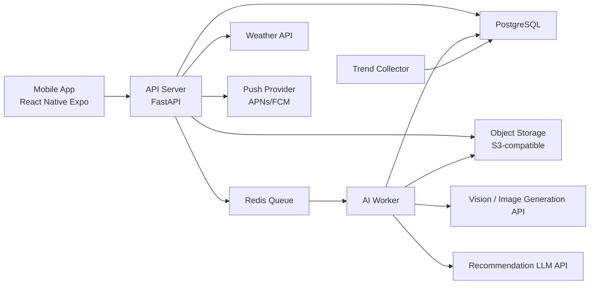
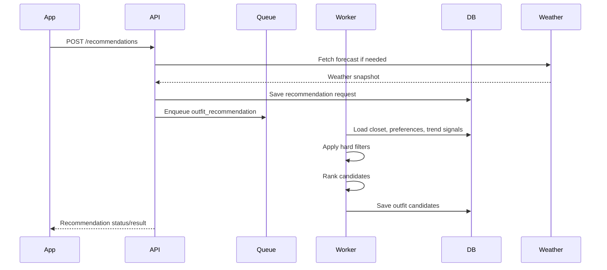

# 03. System Architecture

## 1. 권장 아키텍처

MVP는 모바일 앱, API 서버, 비동기 AI 워커, 데이터베이스, 이미지 저장소로 구성한다.

## 2. 기술 선택 초안

### Mobile

- React Native Expo
- TypeScript
- Expo Camera, Image Picker, Notifications
- React Query 또는 TanStack Query
- Zustand 또는 Jotai

### Backend

- FastAPI
- Python 3.12+
- PostgreSQL
- SQLAlchemy 또는 SQLModel
- Alembic migration
- Redis Queue, RQ, Celery 중 택일
- S3 호환 이미지 저장소

### AI and Integrations

- Vision API: 의류 속성 추출, 이미지 품질 판단
- Image Generation API: 의류 일러스트 생성
- LLM API: 자연어 요청 해석, 추천 이유 생성
- Weather API: 현재 날씨와 시간대별 예보
- Push: APNs, FCM

## 3. 서비스 경계

### Mobile App

- 사용자 인증 화면
- 온보딩
- 이미지 촬영/업로드
- AI 처리 결과 검수
- 디지털 옷장 탐색
- 추천 요청과 결과 확인
- 푸시 알림 진입

### API Server

- 인증과 사용자 세션
- 사용자 프로필/설정 관리
- 의류 데이터 CRUD
- 추천 요청 생성
- 날씨 조회와 캐싱
- 푸시 알림 예약과 발송 요청
- 비동기 작업 생성

### AI Worker

- 이미지 품질 검사
- 의류 영역 정제
- 속성 추출
- 일러스트 생성
- 추천 후보 생성과 랭킹
- 추천 이유 생성

### Trend Collector

- 트렌드 키워드 수집
- 지역/계절/스타일 태그 정규화
- 트렌드 시그널 가중치 갱신

## 4. 주요 비동기 작업

| Job | Trigger | Output | Timeout Target |
| --- | --- | --- | --- |
| image_quality_check | image_uploaded | quality score | 5s |
| closet_item_analysis | image_uploaded | attributes, confidence | 15s |
| closet_item_illustration | analysis_completed | generated image | 30s |
| outfit_recommendation | user_request or scheduled | outfit candidates | 10s |
| morning_recommendation | scheduled | saved daily recommendation | 30s |
| trend_refresh | weekly cron | trend signals | batch |

## 5. 데이터 저장 전략

- 원본 이미지는 object storage에 저장한다.
- 일러스트 이미지는 별도 object key로 저장한다.
- 데이터베이스에는 이미지 URL 또는 storage key만 저장한다.
- AI 처리 중간 결과와 신뢰도 점수는 감사와 개선을 위해 저장한다.
- 사용자가 원본 삭제 옵션을 켠 경우 일러스트 생성 완료 후 원본 이미지를 삭제한다.

## 6. 추천 생성 흐름

## 7. 보안 원칙

- 모든 API는 HTTPS 전제
- 이미지 업로드는 pre-signed URL 사용 권장
- 사용자별 object storage key 분리
- 내부 운영자 원본 이미지 접근 제한
- 위치/알림/사진 권한은 명시적 동의 기반
- 데이터 삭제 요청은 원본 이미지, 일러스트, 메타데이터에 모두 적용

## 8. 확장 고려

- 의류 속성 추출 결과를 벡터화하면 유사 아이템 검색과 추천 개선에 활용할 수 있다.
- 트렌드 시그널과 사용자 선호를 별도 feature store로 분리할 수 있다.
- 아침 추천은 사용자 증가 시 시간대별 배치 큐로 분산해야 한다.
- 이미지 생성 비용이 커지면 캐싱, 저해상도 미리보기, 지연 생성 전략이 필요하다.

