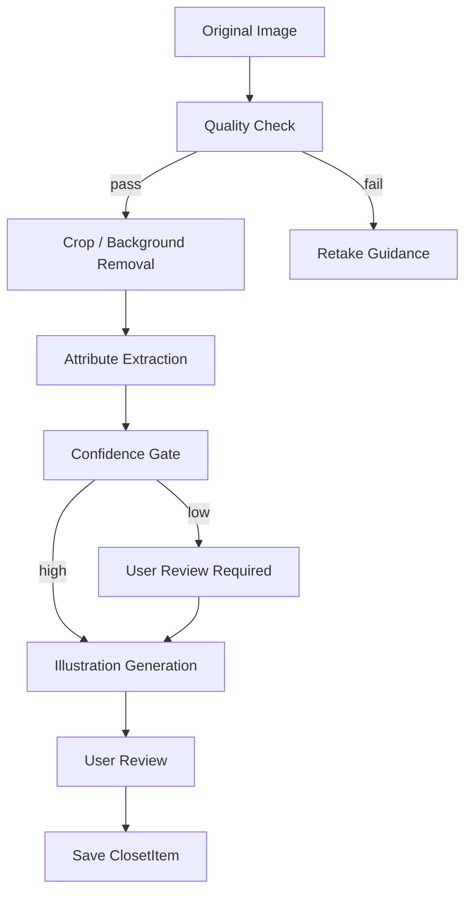

# 04. AI Pipeline

## 1. AI 기능 분해

| 기능 | 입력 | 출력 | MVP 방식 |
| --- | --- | --- | --- |
| 이미지 품질 검사 | 원본 이미지 | 품질 점수, 재촬영 사유 | Vision API |
| 의류 속성 추출 | 의류 이미지 | 카테고리, 색상, 소재, 태그 | Vision API + JSON schema |
| 배경 제거/크롭 | 원본 이미지 | 정제된 의류 이미지 | 외부 API 또는 라이브러리 |
| 일러스트 생성 | 정제 이미지, 스타일 프롬프트 | 일러스트 이미지 | Image generation API |
| 자연어 의도 해석 | 사용자 요청 | 상황, 무드, 제약 조건 | LLM structured output |
| 코디 추천 | 옷장, 날씨, 취향, 트렌드 | 코디 후보, 추천 이유 | 규칙 필터 + LLM ranking |
| 트렌드 정규화 | 트렌드 키워드 | 내부 스타일 태그, 가중치 | 배치 LLM + 운영 검수 |

## 2. 의류 등록 AI 파이프라인



## 3. 의류 속성 추출 계약

AI는 다음 구조의 JSON을 반환해야 한다.

```json
{
  "category": "top",
  "subType": "shirt",
  "colors": [
    { "name": "white", "hex": "#FFFFFF", "role": "primary" }
  ],
  "pattern": "solid",
  "materialGuess": ["cotton"],
  "thickness": "medium",
  "seasons": ["spring", "summer", "fall"],
  "fit": "regular",
  "formality": "business_casual",
  "styleTags": ["minimal", "classic"],
  "confidence": {
    "category": 0.94,
    "color": 0.88,
    "material": 0.62,
    "season": 0.71
  },
  "reviewRequiredFields": ["materialGuess"]
}
```

## 4. 신뢰도 정책

- 카테고리 신뢰도 0.8 미만: 저장 전 사용자 확인 필수
- 색상 신뢰도 0.75 미만: 사용자 확인 권장
- 소재 신뢰도 0.7 미만: "추정"으로 표시
- 계절감은 소재/두께/카테고리 조합 규칙으로 보정
- 낮은 신뢰도 필드는 추천 필터에서 강하게 사용하지 않는다.

## 5. 일러스트 생성 원칙

- 실제 의류의 실루엣, 색상, 패턴, 길이를 유지한다.
- 배경은 투명 또는 서비스 표준 배경으로 통일한다.
- 브랜드 로고는 식별 가능한 복제보다 간략화된 특징 표현을 우선한다.
- 과도한 스타일 변형, 인물 추가, 착용자 생성은 금지한다.
- 사용자가 실제 의류와 다르다고 판단하면 재생성할 수 있다.

## 6. 자연어 요청 해석 계약

```json
{
  "occasion": "work",
  "moodTags": ["clean", "minimal"],
  "formality": "business_casual",
  "comfortPriority": "medium",
  "weatherSensitivity": ["rain"],
  "preferredColors": [],
  "excludedColors": [],
  "avoidTags": ["too_flashy"],
  "fixedItemIds": [],
  "excludedItemIds": [],
  "trendLevel": "balanced",
  "clarificationNeeded": false,
  "clarifyingQuestion": null
}
```

## 7. 추천 알고리즘 초안

### 7.1 Hard Filter

다음 조건은 후보에서 제외한다.

- 세탁 중, 수선 중, 판매/나눔 예정 의류
- 사용자가 제외한 의류
- 계절/날씨와 명백히 맞지 않는 의류
- 포멀도가 상황과 크게 맞지 않는 의류
- 최근 착용 반복 제한에 걸린 의류

### 7.2 Candidate Generation

- 기본 조합: 상의 + 하의 + 신발
- 원피스 조합: 원피스 + 신발
- 추운 날씨: 기본 조합 + 아우터
- 비/눈: 신발과 하의 소재 가중치 조정
- 포멀 상황: 포멀도와 색상 안정성 가중치 상승

### 7.3 Ranking Score

```text
score =
  0.25 * user_preference_match +
  0.20 * weather_fit +
  0.15 * color_harmony +
  0.15 * occasion_fit +
  0.10 * trend_match +
  0.10 * freshness +
  0.05 * closet_utilization
```

### 7.4 Explanation

추천 이유는 다음 요소 중 2-3개만 짧게 설명한다.

- 오늘 날씨와의 적합성
- 사용자의 요청한 무드와의 적합성
- 색상/실루엣 조화
- 최근 트렌드와의 연결
- 최근 입지 않은 아이템 활용

## 8. 트렌드 반영 설계

### TrendSignal 필드

- keyword
- normalizedStyleTag
- region
- season
- source
- signalStrength
- collectedAt
- expiresAt

### 갱신 주기

- MVP: 주 1회 수동 또는 반자동 갱신
- 이후: 일 1회 자동 수집과 운영자 검수

### 추천 반영 원칙

- 사용자의 취향과 보유 의류가 우선이다.
- 트렌드는 랭킹 가중치로만 반영하고 필수 조건으로 사용하지 않는다.
- "트렌드 반영 강도"를 낮춘 사용자는 안정적인 기본 조합을 우선한다.

## 9. AI 평가 기준

### 의류 속성 추출

- 카테고리 정확도
- 대표 색상 정확도
- 사용자 수정률
- 낮은 신뢰도 필드 검출률

### 일러스트 생성

- 사용자 재생성 요청률
- 원본 대비 색상 일치도
- 카테고리 식별 가능성
- 스타일 일관성

### 추천

- 추천 저장률
- 긍정 피드백률
- "너무 덥다/춥다" 피드백률
- "너무 튄다" 피드백률
- 실제 착용 기록 전환율

## 10. 안전장치

- 신체 평가, 외모 비하, 성별 고정관념 기반 추천 표현 금지
- 민감한 사진 업로드 차단
- 사용자가 삭제한 이미지와 메타데이터는 추천 데이터셋에서도 제외
- 개인 데이터 기반 모델 개선은 명시적 동의가 있을 때만 수행

