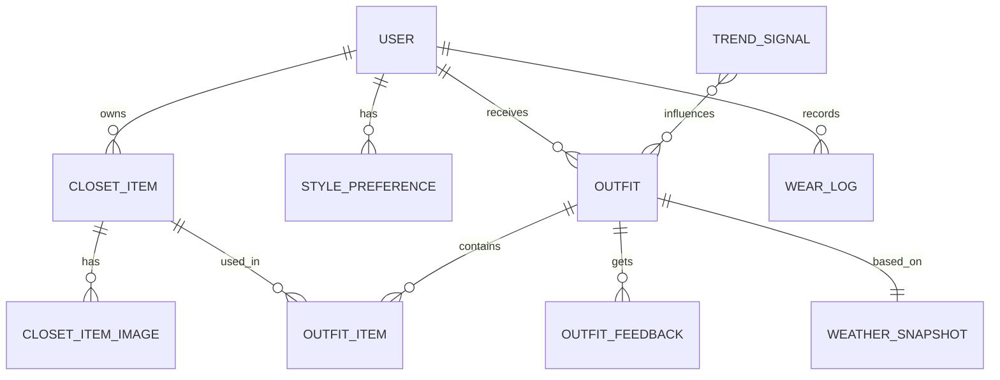

# 05. Data and API Contracts

## 1. 주요 엔티티



## 2. User

| Field | Type | Note |
| --- | --- | --- |
| id | uuid | primary key |
| email | string | nullable for social-only account |
| provider | enum | email, apple, google, kakao 등 |
| nickname | string | display name |
| locale | string | ko-KR 등 |
| timezone | string | Asia/Seoul 등 |
| defaultLocation | json | lat/lng 또는 행정구역 |
| morningNotificationTime | string | HH:mm |
| weekdayNotificationTime | string | optional |
| weekendNotificationTime | string | optional |
| notificationEnabled | boolean | push opt-in |
| imageRetentionMode | enum | keep_original, delete_after_illustration |
| createdAt | datetime |  |
| updatedAt | datetime |  |

## 3. ClosetItem

| Field | Type | Note |
| --- | --- | --- |
| id | uuid | primary key |
| userId | uuid | owner |
| category | enum | top, bottom, outerwear, dress, shoes, bag, accessory |
| subType | string | shirt, knit, denim 등 |
| primaryColor | string | normalized color |
| primaryColorHex | string | optional |
| secondaryColors | json | optional |
| pattern | enum | solid, stripe, check, floral, graphic 등 |
| materialGuess | json | list |
| thickness | enum | light, medium, heavy |
| seasons | json | spring, summer, fall, winter |
| fit | enum | slim, regular, oversized, wide |
| formality | enum | casual, business_casual, formal |
| styleTags | json | minimal, street, classic 등 |
| status | enum | available, laundry, repair, storage, sell_or_donate |
| brand | string | optional |
| size | string | optional |
| memo | text | optional |
| wearCount | int | default 0 |
| lastWornAt | date | optional |
| analysisConfidence | json | AI confidence |
| createdAt | datetime |  |
| updatedAt | datetime |  |

## 4. ClosetItemImage

| Field | Type | Note |
| --- | --- | --- |
| id | uuid | primary key |
| closetItemId | uuid | parent |
| imageType | enum | original, cropped, illustration |
| storageKey | string | object storage key |
| width | int | optional |
| height | int | optional |
| createdAt | datetime |  |

## 5. Outfit

| Field | Type | Note |
| --- | --- | --- |
| id | uuid | primary key |
| userId | uuid | owner |
| requestText | text | nullable for scheduled recommendation |
| occasion | string | work, date, casual 등 |
| moodTags | json | parsed mood |
| trendLevel | enum | basic, balanced, experimental |
| recommendationType | enum | manual, morning |
| weatherSnapshotId | uuid | optional |
| score | float | ranking score |
| reason | text | user-facing explanation |
| status | enum | candidate, saved, worn, dismissed |
| createdAt | datetime |  |

## 6. WeatherSnapshot

| Field | Type | Note |
| --- | --- | --- |
| id | uuid | primary key |
| userId | uuid | owner |
| location | json | lat/lng or city |
| temperature | float | Celsius |
| feelsLike | float | Celsius |
| precipitationProbability | float | 0-1 |
| precipitationType | enum | none, rain, snow |
| humidity | float | 0-1 |
| windSpeed | float | m/s |
| uvIndex | float | optional |
| airQuality | string | optional |
| capturedAt | datetime |  |
| provider | string | weather API provider |

## 7. API 초안

### Auth and User

| Method | Path | Purpose |
| --- | --- | --- |
| POST | /auth/sign-up | 회원가입 |
| POST | /auth/sign-in | 로그인 |
| POST | /auth/social | 소셜 로그인 |
| GET | /me | 내 프로필 조회 |
| PATCH | /me | 내 프로필 수정 |
| PATCH | /me/preferences | 취향 설정 수정 |
| PATCH | /me/notification-settings | 알림 설정 수정 |

### Closet

| Method | Path | Purpose |
| --- | --- | --- |
| POST | /closet-items/uploads | 이미지 업로드 URL 발급 |
| PUT | /closet-items/uploads/{uploadId}/object | 발급된 티켓으로 이미지 바이트 업로드 |
| POST | /closet-items/analyze | 의류 분석 작업 생성 |
| POST | /closet-items/jobs/process-next | 대기 중인 이미지 분석 작업 1건 처리 |
| GET | /closet-items/jobs/{jobId} | 분석 작업 상태 조회 |
| POST | /closet-items | 의류 저장 |
| GET | /closet-items | 의류 목록 |
| GET | /closet-items/{itemId} | 의류 상세 |
| PATCH | /closet-items/{itemId} | 의류 수정 |
| DELETE | /closet-items/{itemId} | 의류 삭제 |

### Recommendation

| Method | Path | Purpose |
| --- | --- | --- |
| POST | /recommendations | 자연어 추천 요청 |
| GET | /recommendations/{recommendationId} | 추천 결과 조회 |
| POST | /recommendations/{recommendationId}/feedback | 피드백 저장 |
| POST | /recommendations/{recommendationId}/save | 추천 저장 |
| POST | /recommendations/{recommendationId}/wear | 오늘 입음 기록 |
| POST | /recommendations/regenerate | 고정/제외 조건 기반 재추천 |

### Recommendation Response

```json
{
  "recommendationId": "uuid",
  "status": "candidate",
  "candidates": [
    {
      "itemIds": ["shirt", "slacks", "loafers"],
      "score": 0.82,
      "reasons": ["요청한 분위기와 맞는 태그를 반영했어요: minimal."],
      "items": [
        {
          "id": "shirt",
          "name": "White shirt",
          "category": "top",
          "subType": "shirt",
          "colors": ["white"],
          "styleTags": ["minimal"]
        }
      ]
    }
  ],
  "createdAt": "2026-06-11T00:00:00Z",
  "updatedAt": "2026-06-11T00:00:00Z"
}
```

### Recommendation Feedback

```json
{
  "feedbackType": "liked",
  "note": "Good for work"
}
```

### Weather and Trends

| Method | Path | Purpose |
| --- | --- | --- |
| GET | /weather/current | 현재 날씨 조회 |
| GET | /trends | 현재 트렌드 시그널 조회 |

### Notification and Morning Scheduler

| Method | Path | Purpose |
| --- | --- | --- |
| GET | /notification-settings | 알림 설정 조회 |
| PATCH | /notification-settings | 알림 설정 수정 |
| POST | /morning-recommendations/run-due | 현재 시점 기준 아침 추천 due 작업 실행 |

### Notification Settings

```json
{
  "enabled": true,
  "timezone": "Asia/Seoul",
  "weekdayNotificationTime": "08:00",
  "weekendNotificationTime": "09:30",
  "locationLabel": "Seoul",
  "latitude": 37.5665,
  "longitude": 126.978
}
```

### Morning Recommendation Run

```json
{
  "now": "2026-06-11T08:00:00+09:00",
  "weather": {
    "temperatureC": 21,
    "feelsLikeC": 21,
    "precipitationProbability": 0.1,
    "precipitationType": "none"
  }
}
```

### Morning Recommendation Run Response

```json
{
  "created": true,
  "reason": "created",
  "runId": "uuid",
  "runDate": "2026-06-11",
  "recommendationId": "uuid",
  "weatherSource": "provided",
  "pushDispatch": {
    "dispatchId": "uuid",
    "recommendationId": "uuid",
    "status": "queued",
    "title": "오늘의 Fitlog 추천",
    "provider": "placeholder"
  }
}
```

## 8. 작업 상태 계약

비동기 작업은 공통 상태 모델을 사용한다.

```json
{
  "jobId": "uuid",
  "type": "closet_item_analysis",
  "status": "queued",
  "progress": 0,
  "result": null,
  "error": null,
  "createdAt": "2026-06-06T00:00:00Z",
  "updatedAt": "2026-06-06T00:00:00Z"
}
```

### Image Upload Ticket

```json
{
  "uploadId": "uuid-or-token",
  "uploadUrl": "/api/v1/closet-items/uploads/{uploadId}/object",
  "method": "PUT",
  "storageKey": "uploads/{uploadId}/white-shirt.jpg",
  "expiresAt": "2026-06-06T00:15:00Z",
  "headers": {
    "Content-Type": "image/jpeg"
  }
}
```

### Image Upload Completion

`uploadUrl`로 받은 경로에 `PUT` 요청을 보내 raw image bytes를 저장한다. `Content-Type`, `byteSize`, `checksumSha256`가 티켓과 다르면 요청은 거절된다.

```json
{
  "uploadId": "uuid-or-token",
  "uploaded": true,
  "storageKey": "uploads/{uploadId}/white-shirt.jpg",
  "contentType": "image/jpeg",
  "byteSize": 12345,
  "checksumSha256": "sha256-hex"
}
```

### Image Analysis Job Creation

분석 작업은 업로드 완료 메타데이터가 저장되고 `storageKey`의 이미지 객체가 실제로 존재할 때만 생성된다. 티켓은 있지만 업로드가 끝나지 않았거나 객체가 사라진 경우 `409 Conflict`와 `Upload object is not ready for analysis.`를 반환한다.

```json
{
  "uploadId": "uuid-or-token",
  "requestedOperations": [
    "quality_check",
    "attribute_extraction",
    "illustration"
  ]
}
```

### Worker Event

```json
{
  "eventType": "image.uploaded",
  "jobId": "uuid",
  "uploadId": "uuid-or-token",
  "storageKey": "uploads/{uploadId}/white-shirt.jpg",
  "requestedOperations": [
    "quality_check",
    "attribute_extraction",
    "illustration"
  ]
}
```

### Image Analysis Worker Run Response

이미지 품질이 충분하지 않으면 작업 상태는 `needs_user_review`가 되고 `quality.usable`은 `false`가 된다. `quality.issues`는 현재 `blur_detected`, `low_light`, `low_resolution` 코드를 사용할 수 있으며, 클라이언트는 이를 사용자용 재촬영 안내로 변환한다.

OpenAI provider는 Responses API의 image input과 strict JSON Schema output을 사용한다. 허용되는 추가 품질 코드는 `item_occluded`, `multiple_items`, `not_clothing`, `poor_framing`이다. Provider 응답은 저장 전에 Fitlog 스키마로 다시 검증된다.

```json
{
  "processed": true,
  "reason": "processed",
  "jobId": "uuid",
  "status": "succeeded",
  "progress": 100,
  "result": {
    "provider": "fitlog_demo",
    "modelVersion": "demo-metadata-draft-v1",
    "quality": {
      "usable": true,
      "score": 0.92,
      "issues": []
    },
    "detectedAttributes": {
      "category": "top",
      "subType": "shirt",
      "colors": [
        {
          "name": "white",
          "hex": "#FFFFFF",
          "role": "primary"
        }
      ],
      "pattern": "solid",
      "materialGuess": ["cotton"],
      "thickness": "medium",
      "seasons": ["all"],
      "fit": "regular",
      "formality": "business_casual",
      "styleTags": ["minimal", "workwear"]
    },
    "closetItemDraft": {
      "name": "white shirt",
      "category": "top",
      "subType": "shirt",
      "seasons": ["all"],
      "styleTags": ["minimal", "workwear"],
      "colors": ["white"],
      "thickness": "medium",
      "formality": "business_casual",
      "status": "available",
      "warmth": 5,
      "rainSafe": false,
      "breathability": 6
    },
    "illustration": {
      "status": "placeholder",
      "storageKey": "illustrations/{jobId}.png",
      "style": "flat-fashion-illustration",
      "background": "transparent"
    }
  },
  "error": null
}
```

대기 작업이 없으면 `processed`는 `false`, `reason`은 `no_queued_jobs`이다.

### Status

- queued
- running
- needs_user_review
- succeeded
- failed
- canceled

## 9. 이벤트 초안

| Event | Producer | Consumer |
| --- | --- | --- |
| image.uploaded | API | AI Worker |
| closet_item.analyzed | AI Worker | API, App |
| closet_item.illustrated | AI Worker | API, App |
| recommendation.requested | API | Recommendation Worker |
| morning_recommendation.due | Scheduler | Recommendation Worker |
| outfit.feedback_created | API | Analytics/Recommendation |
| user.data_deletion_requested | API | Storage/DB cleanup |
